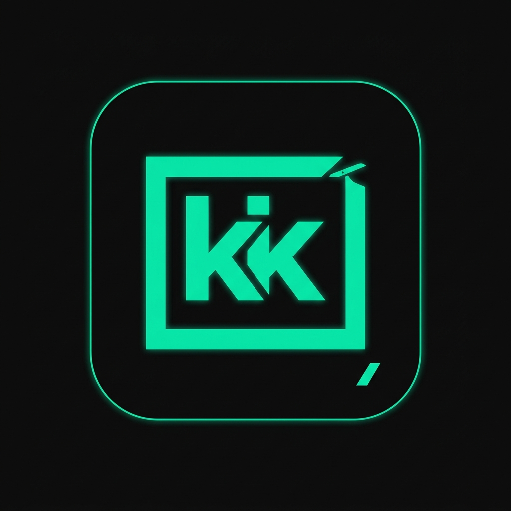

# 🎬 Klip_Kyy — AI Auto-Clip & Viral Meme Studio

<p align="center">
  
</p>

<p align="center">
  <b>Platform AI All-in-One untuk Mengubah Video Panjang YouTube & Video Lokal Menjadi Konten Pendek Viral (YouTube Shorts, TikTok, Instagram Reels) Otomatis Dilengkapi Efek Meme & Soundboard.</b>
</p>

<p align="center">
  
  
  
  
  
</p>

---

## ⚡ Fitur Unggulan

### 1. 🎯 AI Viral Highlight & Exact Dialogue Sync
* **Link YouTube**: Mengunduh video & subtitle otomatis (`.vtt`), mendeteksi momen paling seru/viral menggunakan **Gemini 2.5 Flash**, dan memotong video tepat pada timestamp kalimat diucapkan.
* **Upload Video Lokal**: Dukungan file video lokal (`.mp4`, `.mov`, `.webm`, `.mkv`) dengan transkripsi ucapan otomatis (Google Speech Recognition + Faster-Whisper).

### 2. 🔥 Auto-Meme & SFX Editor
* Menyisipkan efek suara viral (*Vine Boom, Bruh, Cartoon Bonk, Awkward Cricket, Anime Wow, Directed by Weide*) secara otomatis pada momen punchline, keheningan canggung, atau aksi gaming (Maniac/Savage).
* **Dynamic Punch-Zoom**: Efek kamera instan zoom 1.28x ke tengah layar yang tersinkronisasi presisi dengan ketukan audio / drop.

### 3. 🛡️ YouTube Shorts Kit (Anti-Copyright & Fair Use)
* **Paket Copy 1-Klik**: Judul viral catchy (<60 karakter) + Sinopsis narasi + Pertanyaan diskusi pemicu interaksi penonton + Atribusi sumber kredit (`@Creator`) + **Official Fair Use Disclaimer Section 107**.
* **Tagar SEO Relevan**: Hashtags disesuaikan secara dinamis dengan topik video.

### 4. 📐 Multi Aspect Ratio Smart Rendering
* **9:16 Vertical Short**: Canvas vertikal dengan latar belakang video blur estetis (*fast bilinear downscale blur*).
* **16:9 Landscape & 1:1 Square**: Fleksibel untuk berbagai platform.
* Multi-threaded CPU rendering berkecepatan tinggi via FFmpeg.

---

## 🏛️ Arsitektur Sistem: 3-Tier Execution

1. **Tier 1: The Blueprint (Directives)**
   - Terletak di `directives/`: Prosedur Standar Operasional (SOP) untuk pipeline video klip dan aturan audio meme injection.
2. **Tier 2: The Brain (Orchestration)**
   - Backend Laravel 11 + Gemini 2.5 Flash API + React Inertia UI: Routing, status polling, background jobs, dan analisis semantik.
3. **Tier 3: The Muscle (Execution)**
   - Terletak di `execution/`: Script Python deterministik untuk download (`yt_downloader.py`), potong video (`video_cutter.py`), analisis audio (`local_video_analyzer.py`), dan injeksi meme (`video_meme_editor.py`).

---

## 🚀 Panduan Instalasi Lokal

### 1. Prasyarat Sistem
* PHP 8.2+ dengan ekstensi SQLite, cURL, GD
* Composer
* Node.js 18+ & NPM
* Python 3.10+
* FFmpeg (atau package `imageio-ffmpeg`)

### 2. Kloning & Dependensi Backend
```bash
git clone https://github.com/USERNAME/REPO_NAME.git
cd REPO_NAME

composer install
cp .env.example .env
php artisan key:generate
```

### 3. Konfigurasi Database & Storage
```bash
touch database/database.sqlite
php artisan migrate
php artisan storage:link
```

### 4. Dependensi Python & Asset Setup
```bash
pip install yt-dlp faster-whisper SpeechRecognition imageio-ffmpeg google-genai numpy

# Inisialisasi bank suara meme lokal
python execution/setup_meme_assets.py
```

### 5. Dependensi Frontend & Jalankan Server
```bash
npm install
npm run build

# Jalankan server
php artisan serve
```

Buka browser di: `http://127.0.0.1:8000`

---

## 🔑 Environment Variables

Pastikan file `.env` memiliki konfigurasi berikut:
```env
APP_NAME=Klip_Kyy
APP_ENV=local
APP_DEBUG=true
APP_URL=http://127.0.0.1:8000

DB_CONNECTION=sqlite

# Gemini API Key (Opsional, untuk AI highlight & viral copywriting)
GEMINI_API_KEY=your_gemini_api_key_here
```

---

## 📄 Lisensi
Open-source di bawah lisensi [MIT License](LICENSE).
