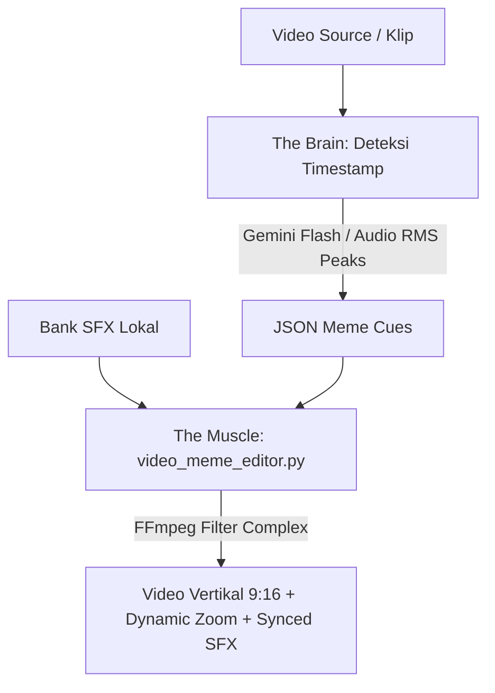

# SOP: Auto-Meme & SFX Video Editing Pipeline

Dokumen ini adalah Prosedur Standar Operasional (SOP) permanen untuk fitur **Auto-Meme & SFX Editor** di **Klip_Kyy** — secara otomatis menambahkan efek suara viral (*Vine Boom, Bruh, Bonk, Jangkrik, Anime Wow, Directed by Weide*) dan efek visual dinamis (*Dynamic Punch-Zoom Kamera*) pada detik-detik penting dalam video klip vertikal.

---

## 1. Prinsip Utama (Core Directives)

> [!IMPORTANT]
> ### 1. Presisi Waktu & Keseimbangan Audio (Zero-Distortion Rule)
> * Efek suara (SFX) **TIDAK BOLEH MENENGGELAMKAN** suara asli video (volume SFX dibatasi pada range `0.9 - 1.2`).
> * Timestamp efek suara **HARUS TERSINKRONISASI** tepat pada detik terjadinya *punchline*, keheningan canggung, atau aksi kill/hype.
> * Efek kamera (*Dynamic Punch-Zoom*) berdurasi singkat (`0.6 - 1.2 detik`) dengan skala `1.2x - 1.3x` agar memberikan kesan dinamis tanpa membuat penonton pusing.

> [!IMPORTANT]
> ### 2. Deterministic & Offline First
> * Seluruh aset audio SFX tersimpan secara lokal di `storage/app/public/memes/sfx/`.
> * Rendering video dieksekusi 100% secara lokal dan deterministik oleh FFmpeg tanpa ketergantungan API pihak ketiga yang berbayar saat proses render.

---

## 2. Alur Eksekusi 3-Tier

### Tahap 1: Bank Aset Meme Lokal (`execution/setup_meme_assets.py`)
* Mengelola bank suara viral lengkap (14 SFX):
  - `vine_boom.wav`: Dentuman sub-bass shockwave untuk momen kaget, punchline, atau plot twist.
  - `metal_pipe.wav`: Suara pipa besi jatuh bergema keras untuk momen konyol atau hantaman tiba-tiba.
  - `taco_bell.wav`: Dentang lonceng bass raksasa untuk momen sial atau karma instan.
  - `bonk.wav`: Efek pukulan kartun kayu untuk momen fail atau kepleset ucapan.
  - `bruh.wav`: Suara "bruh" rendah untuk momen blunder atau kebingungan.
  - `emotional_damage.wav`: Efek viral suara "emotional damage!" untuk roasting pedas.
  - `windows_error.wav`: Nada chord error Windows XP untuk momen gagal mikir / lag otak.
  - `fart_reverb.wav`: Efek bass boost reverb untuk momen shitpost puncak.
  - `huh.wav`: Suara kebingungan "huh?" bernada naik.
  - `run.wav`: Efek EDM drop drumroll "Run!" untuk momen panik atau dikejar musuh.
  - `laugh_wheeze.wav`: Ketawa ngakak sesak napas untuk momen komedi pecah.
  - `cricket.wav`: Suara jangkrik untuk keheningan canggung (*awkward silence*).
  - `anime_wow.wav`: Efek kemilau fairy/anime untuk momen epic, killstreak, atau pencapaian keren.
  - `directed_by.wav`: Melodi outro komedi Robert B. Weide untuk akhir klip blunder.

### Tahap 2: The Brain — Deteksi Multi-Peak Timestamp & Presets
* **Preset Tingkat Keramaian Meme (`--intensity`)**:
  - `santai`: 2 cues (Hook awal & outro punchline). Cocok untuk podcast atau edukasi santai.
  - `rame`: 4–6 cues (Multi-peak hype drops + punchline + dynamic zoom). Cocok untuk gameplay reguler & reaction.
  - `barbar`: 7–10 cues (Rapid-fire soundboard + heavy screen shake pada setiap impact). Cocok untuk montage MLBB, Savage, atau fast-paced TikTok shitpost.
* **Deteksi Cues**:
  - **AI Dialog (Gemini Flash)**: Menganalisis kalimat, roasting, punchlines, dan momen klimaks narasi.
  - **Deteksi Audio Spikes (Deterministic RMS)**: Menemukan titik-titik puncak audio teriakan/ledakan dan merotasi SFX berbobot berat (`vine_boom`, `metal_pipe`, `taco_bell`) dengan `screen_shake: true`.

### Tahap 3: The Muscle — FFmpeg Video Meme Engine (`execution/video_meme_editor.py`)
* Menggabungkan video vertikal 9:16 dengan:
  - **Camera Screen Shake (Layar Getar)**: Menggunakan filter crop statis `crop=w=1040:h=1880:x='20+20*sin(t*65)':y='20+20*cos(t*65)',scale=1080:1920` yang digabungkan via `overlay` berwaktu `enable='between(t, s, e)'` untuk getaran kamera instan saat ledakan/bass drop.
  - **Dynamic Punch-Zoom**: Menggunakan branch `split` + `crop` + `scale` + `overlay` dengan filter waktu `enable='between(t, start, end)'`.
  - **Multi-channel SFX Mix**: Menggunakan `adelay` untuk menempatkan masing-masing SFX pada milidetik yang tepat, digabungkan dengan `amix`.
* Output disimpan sebagai file MP4 beresolusi tinggi dengan kompresi `veryfast` dan audio AAC.
