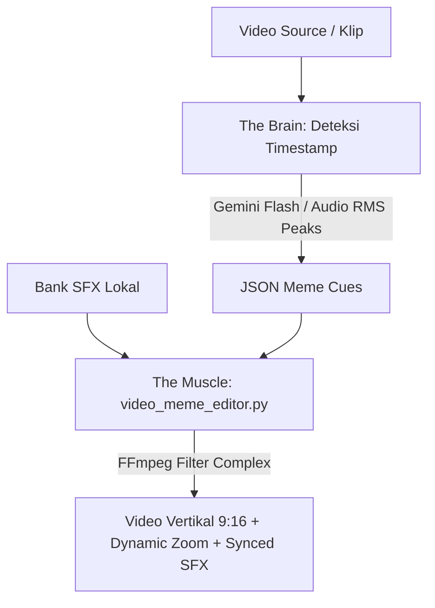

# SOP: Auto-Meme & SFX Video Editing Pipeline

Dokumen ini adalah Prosedur Standar Operasional (SOP) permanen untuk fitur **Auto-Meme & SFX Editor** di **Klip_Kyy** — secara otomatis menambahkan efek suara viral (*Vine Boom, Bruh, Bonk, Jangkrik, Anime Wow, Directed by Weide*) dan efek visual dinamis (*Dynamic Punch-Zoom Kamera*) pada detik-detik penting dalam video klip vertikal.

---

## 1. Prinsip Utama (Core Directives)

> [!IMPORTANT]
> ### 1. Presisi Waktu & Keseimbangan Audio (Zero-Distortion Rule)
> * Efek suara (SFX) **TIDAK BOLEH MENENGGELAMKAN** suara asli video (volume SFX dibatasi pada range `0.9 - 1.2`).
> * Timestamp efek suara **HARUS TERSINKRONISASI** tepat pada detik terjadinya *punchline*, keheningan canggung, atau aksi kill/hype.
> * Efek kamera (*Dynamic Punch-Zoom*) berdurasi singkat (`0.6 - 1.2 detik`) dengan skala `1.2x - 1.3x` agar memberikan kesan dinamis tanpa membuat penonton pusing.

> [!IMPORTANT]
> ### 2. Deterministic & Offline First
> * Seluruh aset audio SFX tersimpan secara lokal di `storage/app/public/memes/sfx/`.
> * Rendering video dieksekusi 100% secara lokal dan deterministik oleh FFmpeg tanpa ketergantungan API pihak ketiga yang berbayar saat proses render.

---

## 2. Alur Eksekusi 3-Tier

### Tahap 1: Bank Aset Meme Lokal (`execution/setup_meme_assets.py`)
* Mengelola bank suara viral standar:
  - `vine_boom.wav`: Dentuman bass shockwave untuk momen kaget, punchline, atau plot twist.
  - `bruh.wav`: Suara "bruh" rendah untuk momen blunder atau kebingungan.
  - `bonk.wav`: Efek pukulan kartun untuk momen fail, kepleset ucapan, atau tertimpa nasib sial.
  - `cricket.wav`: Suara jangkrik untuk keheningan canggung (*awkward silence*).
  - `anime_wow.wav`: Efek kemilau fairy/anime untuk momen epic, killstreak, atau pencapaian keren.
  - `directed_by.wav`: Melodi outro komedi Robert B. Weide untuk akhir klip blunder.

### Tahap 2: The Brain — Deteksi Timestamp Meme
* **Klip dengan Dialog (Vlog, Podcast, Tanya Jawab)**:
  - Di-parse oleh Gemini Flash di `execution/ai_highlight_extractor.py`.
  - Menganalisis transkrip teks dan menentukan `meme_cues` berbasis makna kalimat.
* **Klip Non-Dialog / Gaming (Mobile Legends, Gameplay, Montase)**:
  - Di-parse oleh detektor energi audio di `execution/local_video_analyzer.py`.
  - Menganalisis lonjakan volume audio (*volume spikes*) untuk killstreak/hype (Maniac/Savage), serta lembah keheningan (*silence valleys*) untuk efek canggung/bruh.

### Tahap 3: The Muscle — FFmpeg Video Meme Engine (`execution/video_meme_editor.py`)
* Menggabungkan video vertikal 9:16 dengan:
  - **Dynamic Punch-Zoom**: Menggunakan branch `split` + `crop` + `scale` + `overlay` dengan filter waktu `enable='between(t, start, end)'`.
  - **Multi-channel SFX Mix**: Menggunakan `adelay` untuk menempatkan masing-masing SFX pada milidetik yang tepat, digabungkan dengan `amix`.
* Output disimpan sebagai file MP4 beresolusi tinggi dengan kompresi `veryfast` dan audio AAC.
